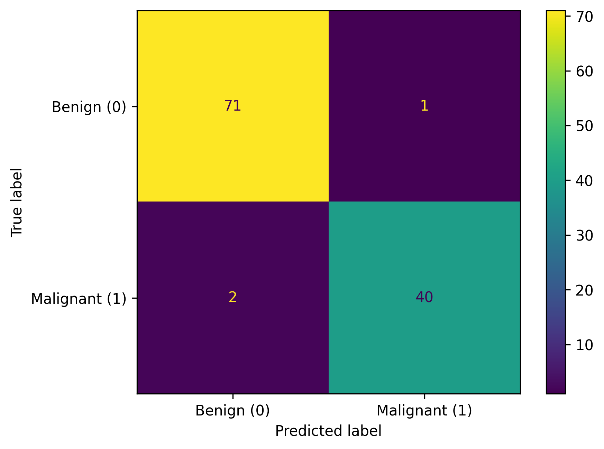

# Predicting Cancerous Tumor with Logistic Regression

I made a Logistic Regression model to predict whether a tumor is benign or malignant based on clinical features using diagnosis.csv. This project explores how diagnostic attributes can enable early detection, providing actionable insights for medical decision-making and demonstrating the value of data-driven classification in healthcare scenarios.

## How It Works

**Dataset:** "diagnosis.csv" with 569 entries and 33 columns, featuring clinical attributes (e.g., tumor size, clump thickness) and a binary target (diagnosis: B=benign, M=malignant).

**Approach:** Performed exploratory data analysis (checked data shape, null values, skewness, outliers via boxplots, target distribution, feature correlations), preprocessed data (converted target to numeric, applied log transformation to skewed features, scaled with StandardScaler), and trained a Logistic Regression model (class_weight='balanced', max_iter=1000) using a pipeline with stratified train-test split.

**Tools:** Python, pandas, numpy, scikit-learn, matplotlib, seaborn, joblib.

## What I Achieved

**Results:** The model achieves ~97% accuracy, with precision, recall, and F1-score ranging from 0.96–0.98, and high ROC-AUC, showing strong classification performance.

**Insights:** Rigorous EDA and preprocessing (e.g., log transformation for skewed features, balanced class weights) ensure robust predictions; future enhancements could include feature selection or advanced models like Random Forests for marginal gains.

**Visualization:** Confusion Matrix of Model Predictions

  

## Setup

1.Clone the repo: git clone https://github.com/zainshah871/ML-Classification-TumorPrediction-Project4.git
2.Install dependencies: pip install -r requirements.txt
3.Open tumor_prediction.ipynb in Jupyter to run and explore the model.

## 🤝Connect for Collaboration
Open to discussions on ML, tech innovations, or joint projects—let’s build something impactful! 

- <a href="https://www.linkedin.com/in/zain-shah-871aa532a">
     LinkedIn
  </a>

- <a href="https://x.com/zainshah_x">
     Twitter (X)
  </a>

- <a href="mailto:btenmeten12345@gmail.com">
     Gmail
  </a>

Star if useful, and check my profile for more projects!